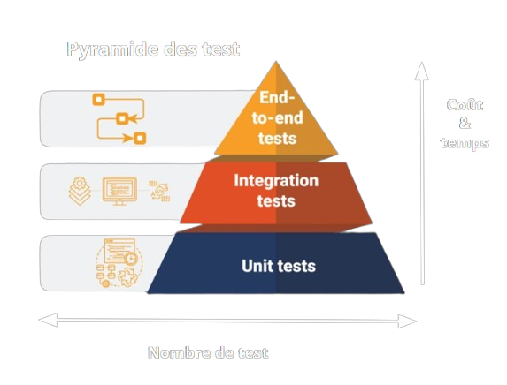

# Rapport sur les Tests d'Intégration en Développement Logiciel  

> **Note d'utilisation**: Ce fichier README peut être visualisé avec une mise en forme optimale directement dans votre navigateur Chrome grâce à l'extension **Markdown Reader**. 
>
> 📌 [Télécharger l'extension Markdown Reader pour Chrome](https://chromewebstore.google.com/detail/markdown-reader/medapdbncneneejhbgcjceippjlfkmkg)

## Introduction  
Dans le cadre du développement logiciel, les tests constituent un élément fondamental garantissant la qualité, la robustesse et la fiabilité des applications. Parmi les différents types de tests, les tests d’intégration occupent une place centrale puisqu’ils assurent la communication fluide entre les différents modules d’une application. Ce rapport vise à fournir une vue d'ensemble des tests d'intégration, en détaillant leur rôle, les approches courantes pour leur mise en œuvre, ainsi que leur mise en pratique dans un environnement de développement C++ avec des outils comme Visual Studio.  

---

### Théorie Générale sur les Tests  
Les tests en développement logiciel peuvent être classés en plusieurs catégories, chacun répondant à des besoins spécifiques : 

Souvent représentés sous forme d’une pyramide pour illustrer leur hiérarchie en termes de nombre de tests, de coût et de temps.  

  

  

Cette pyramide montre :    

### a) **Tests unitaires**  
Les tests unitaires se concentrent sur des composants individuels du code, comme des fonctions ou des classes, en les testant de manière isolée. Leur objectif principal est de vérifier que ces composants fonctionnent comme prévu.  

- **Avantages** : Simples à écrire, rapides à exécuter.  
- **Limites** : Seuls des modules isolés sont testés, sans prendre en compte leur intération avec le reste du système.  

### b) **Tests d’intégration**  
Les tests d’intégration vérifient les interactions entre plusieurs modules ou composants d’une application. Contrairement aux tests unitaires, ils s'assurent que les différents éléments du système fonctionnent ensemble correctement.  

- **Avantages** : Détectent des erreurs invisibles dans les tests unitaires (erreurs d’interfaçage, incompatibilités).  
- **Importance** : Ils permettent d’identifier des anomalies dans la communication entre composants, dans l’intégration avec des API externes ou des bases de données, et dans des scénarios réalistes.  

### c) **Tests d’interface utilisateur (E2E)**  
Les tests d'interface utilisateur (End-to-End) valident le système dans sa globalité, comme un utilisateur final interagissant avec l’application.  

- **Avantages** : Simulation réaliste du comportement utilisateur.  
- **Limites** : Tests souvent complexes, plus lents à exécuter.  
 

---

## 2. Différentes Approches des Tests d'Intégration  

Lorsqu'il s'agit de mettre en œuvre des tests d'intégration, différentes stratégies peuvent être adoptées pour organiser et exécuter ces tests. Ces approches sont choisies en fonction des besoins et de l'architecture du projet.  

### a) **Top-Down**  
Les tests progressent des modules les plus élevés dans la hiérarchie (modules de haut niveau) vers les modules inférieurs.  

- **Avantages** : Permet une détection rapide des défauts dans les modules majeurs utilisés directement par l'utilisateur.  
- **Inconvénients** : Les modules de bas niveau nécessitent souvent des "drivers" ou composants simulés pour permettre leur test à des niveaux inférieurs.  

### b) **Bottom-Up**  
Les tests démarrent depuis les modules bas niveau, qui sont intégrés progressivement pour former des modules plus complexes.  

- **Avantages** : Les modules fondamentaux sont testés très tôt.  
- **Inconvénients** : Le flux d'information peut ne pas être validé correctement au départ, car les modules de haut niveau sont initialement absents.  

### c) **Approche Sandwich**  
Un mélange des deux approches précédentes, combinant les tests top-down et bottom-up simultanément.  

- **Avantages** : Teste efficacement les interactions clés entre les couches intermédiaires.  
- **Inconvénients** : Plus complexe à mettre en place.  

### d) **Big-Bang**  
Tous les modules sont intégrés et testés simultanément après le développement complet.  

- **Avantages** : Permet de tester l’ensemble du système à la fois.  
- **Inconvénients** : Les erreurs sont difficiles à isoler, et il est risqué d’attendre la fin du développement pour identifier les problèmes.  

L'approche idéale dépend des caractéristiques de l'application et de l’organisation du projet. Par exemple, le Big-Bang peut être adapté à des projets de petite taille, tandis que le top-down ou le bottom-up sont recommandés pour des architectures complexes.  

---

## 3. Tests d'Intégration en Pratique (Exemple : C++)  

Pour illustrer la mise en pratique des tests d’intégration, prenons un exemple basé sur le langage C++ et l’environnement de développement Visual Studio.  

### a) **Configuration d’un environnement adapté**  
Visual Studio offre un support riche pour la mise en œuvre des tests unitaires et d’intégration grâce au **Test Explorer**. Celui-ci permet de :  
- Écrire des tests de manière structurée en utilisant des frameworks comme *Google Test* ou *Microsoft Unit Test Framework*.  
- Exécuter des tests via une interface claire et obtenir des rapports détaillés sur les résultats.  

### b) **Mise en place des tests d'intégration**  
1. **Identification des modules interconnectés** : Par exemple, dans une application C++, cela pourrait inclure des classes qui communiquent entre elles via des interfaces ou via des appels à des API externes.  
2. **Création des cas de test** : Les cas de test spécifiques doivent être écrits pour valider les flux de données entre modules, ainsi que les conditions limites.  
3. **Utilisation des mocks/stubs** : Pour simuler certains comportements (comme l’interaction avec une API distante), les tests peuvent utiliser des mocks ou stubs pour remplacer des composants réels.  

### c) **Intégration continue et gestion des versions**  
L’intégration continue (*CI*) est une pratique clé associée aux tests d’intégration. En configurant des outils comme GitHub Actions ou Azure DevOps, les tests d’intégration peuvent être automatisés à chaque nouvelle modification du code. Cela permet de garantir une qualité constante sans travail manuel supplémentaire.  

---

## 4. Valeur Ajoutée des Tests d'Intégration  

Les tests d'intégration sont essentiels pour vérifier les interactions entre les différents modules et trouver des défauts souvent invisibles aux tests unitaires :  
- Ils mettent en lumière des problèmes tels que des erreurs d’interface entre deux modules, des appels API erronés ou des incompatibilités dans les formats de données échangées.  
- Ils testent également l'intégration avec des systèmes extérieurs (bases de données, services cloud ou bibliothèques tierces) pour garantir leur bon fonctionnement dans l'environnement global.  

Par exemple, un test unitaire peut vérifier qu’une classe ouvre bien une connexion à une base de données. Cependant, un test d’intégration assurera que les données envoyées et reçues entre le serveur et l’application sont correctes, détectant ainsi des erreurs que des tests isolés n’auraient pu révéler.  

---

## Conclusion  

En conclusion, les tests d’intégration jouent un rôle fondamental dans le processus de développement en assurant l’interopérabilité et la cohérence des différents modules. Lorsqu’ils sont mis en œuvre à l’aide de bonnes pratiques, comme l’automatisation dans un flux d’intégration continue, ils contribuent grandement à l’amélioration de la qualité globale des logiciels. Visual Studio et des frameworks spécifiques à C++ permettent de simplifier leur écriture et leur exécution tout en les intégrant dans un cycle de développement agile et itératif.  

Pour un développement logiciel robuste et fiable, les tests d’intégration ne doivent pas être négligés, car ils complètent efficacement les tests unitaires et mettent en évidence des problèmes complexes invisibles dans des tests isolés.  

---

## Sources  

1. [QESTIT - Tests unitaires vs. Tests d’intégration](https://qestit.com/fr/blog/tests-unitaires-tests-integration)  
2. [La Console Dev - Différences entre test unitaire, integration et E2E](https://laconsole.dev/blog/differences-test-unitaire-integration-e2e#rôle-2)  
3. [Wikipédia - Test d’intégration](https://fr.wikipedia.org/wiki/Test_d'intégration)  
4. [Microsoft Learn - Exécuter des tests unitaires avec Visual Studio](https://learn.microsoft.com/fr-fr/visualstudio/test/run-unit-tests-with-test-explorer?view=vs-2022)  
5. [Microsoft Learn - Écrire des tests unitaires pour C++](https://learn.microsoft.com/fr-fr/visualstudio/test/writing-unit-tests-for-c-cpp?view=vs-2022)  
6. "[YouTube - Tests logiciels explicatifs](https://www.youtube.com/watch?v=7_H4qzhWbnQ)"  
